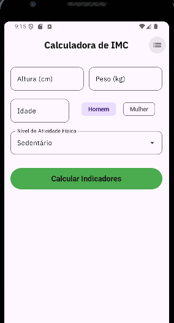

# 📱 Calculadora de IMC & Monitor de Saúde

Aplicativo Android nativo desenvolvido em Kotlin com Jetpack Compose para a disciplina de Programação para Dispositivos Móveis (PDM).

## ✨ Funcionalidades

* *Cálculo de IMC:* Com classificação de cores e faixas da OMS.
* *Análise de Saúde Completa:*
    * Taxa Metabólica Basal (Fórmula Mifflin-St Jeor).
    * Peso Ideal (Fórmula de Devine).
    * Necessidade Calórica Diária baseada em atividade física.
* *Histórico Detalhado:* Salva todas as medições no dispositivo.
* *Gráficos:*
    * Velocímetro interativo na tela de detalhes.
    * Gráfico de linha mostrando a evolução do IMC ao longo do tempo.
* *Modo Escuro/Claro:* Suporte nativo do Material Design 3.

## 🛠️ Tecnologias Utilizadas

* *Linguagem:* Kotlin
* *UI:* Jetpack Compose (Material 3)
* *Arquitetura:* MVVM (Model-View-ViewModel)
* *Persistência:* Room Database (SQLite)
* *Navegação:* Jetpack Navigation Compose
* *Assincronismo:* Kotlin Coroutines & Flow

## 📸 Screenshots

| Tela Inicial | Histórico | Detalhes |
|:---:|:---:|:---:|
|  |  |  |

## 👨‍💻 Autores

* *Pedro Lucas Rodrigues Santos
* *Gabriel Faria de Angelis*

---
Trabalho 2 - Universidade Federal de Uberlândia (UFU)